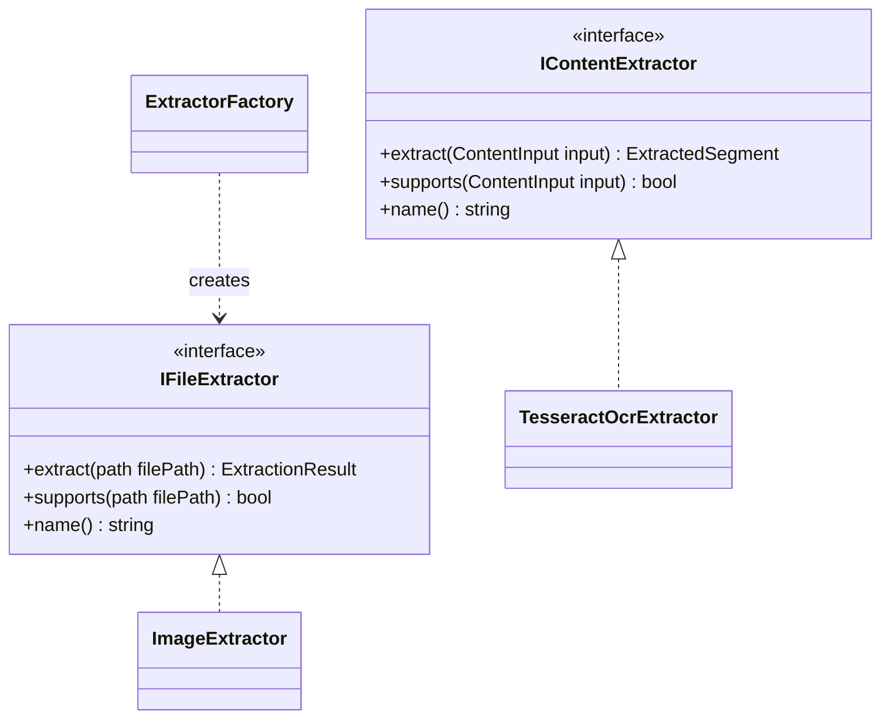

# Contexto de Proyecto - 2026-08-19

## Objetivo

Continuar el backend C++ del sistema de archivos semantico, enfocandose en una arquitectura limpia para extractores de archivos, servicios reutilizables de extraccion de contenido y Factory Method.

El objetivo tecnico actual es separar:

- Extractores de archivo completo.
- Funcionalidades internas reutilizables.
- Resultado unico por archivo original, aunque internamente haya varios segmentos extraidos.

## Estado General del Backend

Ruta del proyecto:

```text
C:\Users\54343\OneDrive\Desktop\sistema_archivos_semanticos
```

Ruta del backend:

```text
C:\Users\54343\OneDrive\Desktop\sistema_archivos_semanticos\Backend
```

Stack actual:

- C++20.
- CMake.
- vcpkg.
- Makefile.
- MSVC / Visual Studio en Windows.
- Tesseract OCR.
- Leptonica.
- fmt.
- spdlog.
- nlohmann-json.

## Cambios Mas Recientes

Fecha de cambios: 2026-08-19.

Se implemento el diseno base de extractores:

- `IFileExtractor`: interfaz para extractores de archivos completos.
- `IContentExtractor`: interfaz para funcionalidades reutilizables de extraccion interna.
- `ExtractionResult`: resultado general asociado al archivo original.
- `ExtractedSegment`: fragmento de contenido extraido.
- `ContentInput`: entrada generica para servicios internos.
- `ImageExtractor`: extractor concreto de imagenes, todavia sin conectar OCR.
- `TesseractOcrExtractor`: ahora hereda de `IContentExtractor`.
- `ExtractorFactory`: factory minima que por ahora devuelve `ImageExtractor` para imagenes.
- UML actualizado en `agents/extractors_uml.md`.

## Archivos Nuevos o Modificados

Interfaces y tipos base:

```text
Backend/include/semantic_fs/extractors/extraction_types.h
Backend/include/semantic_fs/extractors/i_file_extractor.h
Backend/include/semantic_fs/extractors/i_content_extractor.h
```

Extractor de imagen:

```text
Backend/include/semantic_fs/extractors/image_extractor.h
Backend/src/extractors/image_extractor.cpp
```

Factory:

```text
Backend/include/semantic_fs/extractors/extractor_factory.h
Backend/src/extractors/extractor_factory.cpp
```

OCR:

```text
Backend/include/semantic_fs/extractors/tesseract_ocr_extractor.h
Backend/src/extractors/tesseract_ocr_extractor.cpp
```

Debug CLI:

```text
Backend/src/app/main.cpp
```

Documentacion de agentes:

```text
agents/extractors_uml.md
agents/context_2026-08-19_extractors_factory_ocr.md
```

## Diseno Conceptual

La arquitectura separa dos ramas:

```text
IFileExtractor
  -> ImageExtractor
  -> PdfExtractor futuro
  -> TextExtractor futuro
  -> AudioExtractor futuro
  -> VideoExtractor futuro

IContentExtractor
  -> TesseractOcrExtractor
  -> WhisperContentExtractor futuro
  -> PdfTextContentExtractor futuro
  -> PdfImageContentExtractor futuro
```

Regla importante:

```text
extends = es un tipo de
uses    = usa una funcionalidad
```

Ejemplos:

```text
ImageExtractor extends IFileExtractor
TesseractOcrExtractor extends IContentExtractor
PdfExtractor uses TesseractOcrExtractor
ImageExtractor todavia NO usa TesseractOcrExtractor
```

## Interfaces Implementadas

### IFileExtractor

Representa extractores de archivos completos.

```cpp
class IFileExtractor {
public:
    virtual ~IFileExtractor() = default;

    virtual ExtractionResult extract(const std::filesystem::path& filePath) const = 0;
    virtual bool supports(const std::filesystem::path& filePath) const = 0;
    virtual std::string name() const = 0;
};
```

Funciones:

- `extract(filePath)`: procesa un archivo original completo.
- `supports(filePath)`: indica si el extractor soporta ese archivo.
- `name()`: devuelve el nombre del extractor para logs/debug.

### IContentExtractor

Representa funcionalidades reutilizables de extraccion interna.

```cpp
class IContentExtractor {
public:
    virtual ~IContentExtractor() = default;

    virtual ExtractedSegment extract(const ContentInput& input) const = 0;
    virtual bool supports(const ContentInput& input) const = 0;
    virtual std::string name() const = 0;
};
```

Funciones:

- `extract(input)`: extrae contenido desde una entrada interna.
- `supports(input)`: indica si esa funcionalidad soporta la entrada.
- `name()`: devuelve el nombre del servicio extractor.

## Tipos Base

Archivo:

```cpp
enum class FileType {
    Unknown,
    Text,
    Image,
    Pdf,
    Audio,
    Video
};
```

Contenido:

```cpp
enum class ContentType {
    Unknown,
    Text,
    Image,
    Audio,
    VideoFrame
};
```

Entrada interna:

```cpp
struct ContentInput {
    ContentType type = ContentType::Unknown;
    std::filesystem::path path;
    std::string source;
    int page = -1;
    double timestamp = -1.0;
};
```

Segmento extraido:

```cpp
struct ExtractedSegment {
    std::string text;
    std::string source;
    ContentType contentType = ContentType::Unknown;
    int page = -1;
    double timestamp = -1.0;
};
```

Resultado general:

```cpp
struct ExtractionResult {
    std::filesystem::path originalPath;
    FileType fileType = FileType::Unknown;
    std::vector<ExtractedSegment> segments;
};
```

## ImageExtractor

`ImageExtractor` hereda de `IFileExtractor`.

Responsabilidades actuales:

- Detectar si un archivo tiene extension de imagen.
- Devolver un `ExtractionResult` asociado al archivo original.
- No ejecutar OCR todavia.

Extensiones soportadas:

```text
.png
.jpg
.jpeg
.bmp
.tif
.tiff
.webp
```

Motivo por el que no usa OCR aun:

El usuario quiere resolver primero la parte visual, es decir detectar o distinguir figuras/contenido visual antes de conectar OCR como servicio interno.

## TesseractOcrExtractor

`TesseractOcrExtractor` ahora hereda de `IContentExtractor`.

Responsabilidades:

- Recibir un `ContentInput` de tipo `ContentType::Image`.
- Usar Tesseract y Leptonica para leer la imagen.
- Extraer texto.
- Devolver un `ExtractedSegment`.

Uso por polimorfismo en `main.cpp`:

```cpp
const semantic_fs::extractors::IContentExtractor& extractor =
    semantic_fs::extractors::TesseractOcrExtractor("eng", "tessdata");

const auto segment = extractor.extract(input);
```

Tambien mantiene metodos directos:

```cpp
std::string extractText(const std::string& imagePath) const;
std::string extractText(const std::filesystem::path& imagePath) const;
```

## ExtractorFactory

`ExtractorFactory` es la base del Factory Method.

Estado actual:

- Recibe un `std::filesystem::path`.
- Crea un `ImageExtractor`.
- Si `ImageExtractor::supports(filePath)` devuelve `true`, lo retorna.
- Si no hay extractor disponible, lanza `std::runtime_error`.

Todavia falta agregar:

- `PdfExtractor`.
- `TextExtractor`.
- `AudioExtractor`.
- `VideoExtractor`.
- Registro dinamico o lista de extractores si conviene escalar.

## UML

El UML actualizado esta en:

```text
agents/extractors_uml.md
```

Resumen del diagrama:



## Compilacion Verificada

Se verifico el build en Debug con:

```powershell
cd C:\Users\54343\OneDrive\Desktop\sistema_archivos_semanticos\Backend
cmake -S . -B build-vcpkg -DCMAKE_TOOLCHAIN_FILE=C:\tools\vcpkg\scripts\buildsystems\vcpkg.cmake
cmake --build build-vcpkg --config Debug
```

Resultado:

```text
semantic_fs_backend.exe generado correctamente
```

Tambien se ejecuto:

```powershell
.\build-vcpkg\Debug\semantic_fs_backend.exe
```

Resultado:

```text
Usage: semantic_fs_backend <image_path>
```

## Decision Pendiente Importante

No conectar todavia `ImageExtractor` con `TesseractOcrExtractor`.

Razon:

Antes de conectar OCR, el usuario quiere resolver la parte visual/virtual de imagenes: detectar o distinguir distintas figuras o tipos de contenido visual.

Cuando esa parte este resuelta, `ImageExtractor` deberia usar composicion:

```text
ImageExtractor uses IContentExtractor
```

Pero no deberia heredar de OCR.

## Proximos Pasos Recomendados

1. Definir que significa "distinguir figuras" dentro de `ImageExtractor`.
2. Crear una interfaz para analisis visual si hace falta, por ejemplo:

```cpp
class IVisualContentAnalyzer {
public:
    virtual ~IVisualContentAnalyzer() = default;
    virtual VisualAnalysisResult analyze(const std::filesystem::path& imagePath) const = 0;
};
```

3. Definir `VisualAnalysisResult`.
4. Decidir si OCR se ejecuta:
   - siempre sobre imagenes,
   - solo cuando se detecta texto,
   - o segun una clasificacion previa.
5. Luego conectar `ImageExtractor` con `IContentExtractor` por composicion.
6. Expandir `ExtractorFactory` para PDF y texto.

## Prompt Para Continuar En Otro Proyecto

Estoy continuando el backend C++ de un sistema de archivos semantico. Usa como contexto autorizado este archivo y los documentos dentro de la carpeta `agents`.

Estado actual:

- Hay una arquitectura base de extractores.
- `IFileExtractor` representa extractores de archivos completos.
- `IContentExtractor` representa funcionalidades reutilizables internas.
- `TesseractOcrExtractor` hereda de `IContentExtractor` y extrae texto por polimorfismo.
- `ImageExtractor` hereda de `IFileExtractor`, detecta extensiones de imagen y devuelve `ExtractionResult`, pero todavia no usa OCR.
- `ExtractorFactory` existe y por ahora crea `ImageExtractor`.
- El UML esta en `agents/extractors_uml.md`.

Tarea inmediata:

Revisar los archivos actuales del backend, entender esta arquitectura y continuar con el diseno de la parte visual de `ImageExtractor` antes de conectar OCR.

Restricciones:

- Mantener C++20.
- Mantener CMake y vcpkg.
- Usar composicion para servicios reutilizables.
- No mezclar extractores de archivo con servicios internos.
- Todo resultado debe pertenecer al archivo original.
