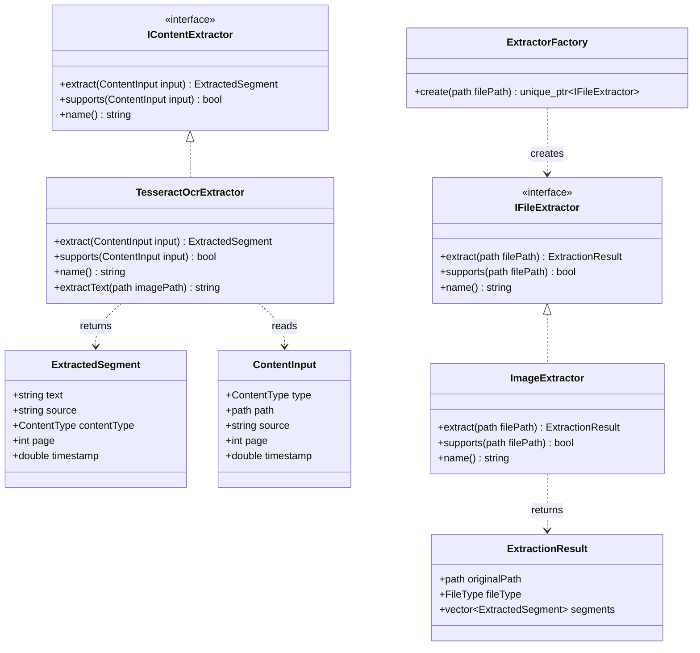

# Extractors UML

Este diagrama separa dos ramas:

- `IFileExtractor`: extractores de archivos completos.
- `IContentExtractor`: funcionalidades reutilizables para extraer contenido interno.



## Flujo actual

```text
archivo de imagen
    -> ExtractorFactory
    -> ImageExtractor
    -> ExtractionResult vacio, sin OCR conectado todavia

imagen para debug OCR
    -> IContentExtractor
    -> TesseractOcrExtractor
    -> ExtractedSegment con texto
```

## Decision de diseno

`ImageExtractor` todavia no usa `TesseractOcrExtractor`. Esto deja separada la parte de reconocer y clasificar figuras/contenido visual antes de conectar OCR como servicio interno.
